# Laos

This is my final project on Laos, where I analyzed the population and utilities in Xaythany and Mayparkngum. 

## Population of Laos' Regions

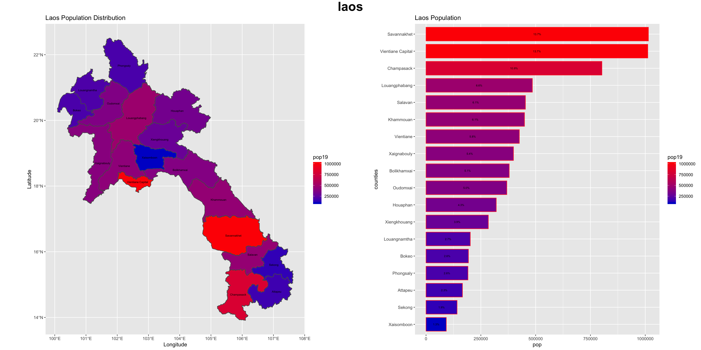

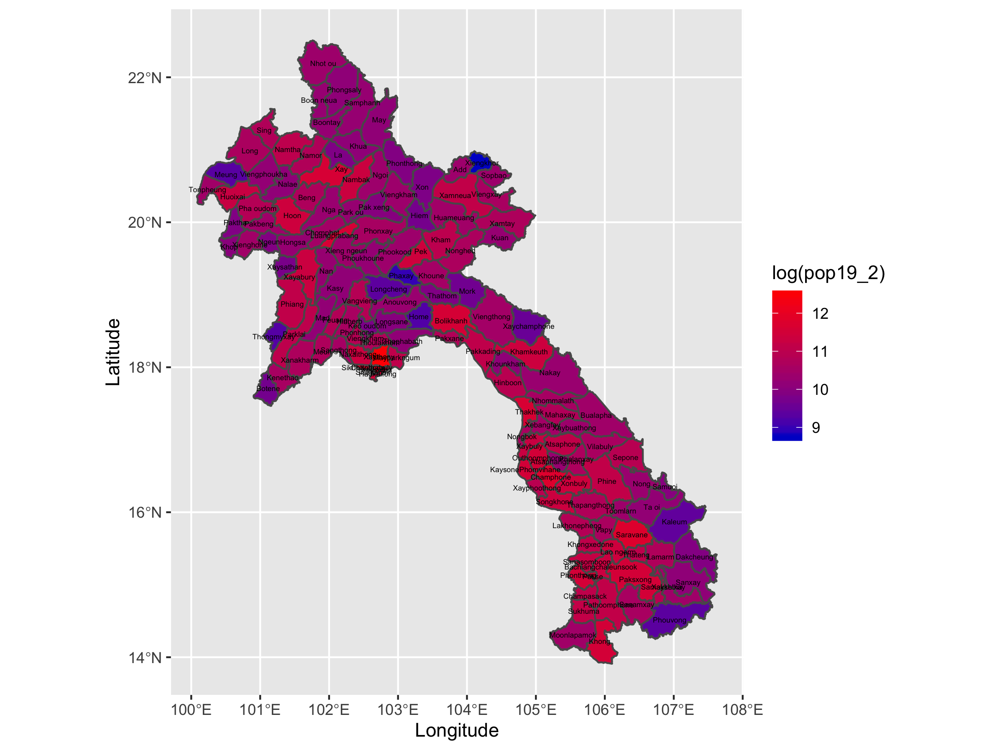

The density plots of Laos shows that the population is very spread out, with Savannakhet and Vientiane Capital being the highest population regions. The areas of lower population, namely the the areas above Vientiane Capital, are located in the Annamite mountain, explaining why the lower regions have more population and the higher ones have less. 

## Histograms

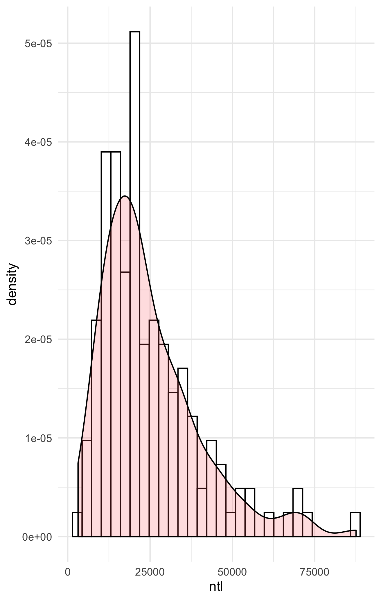

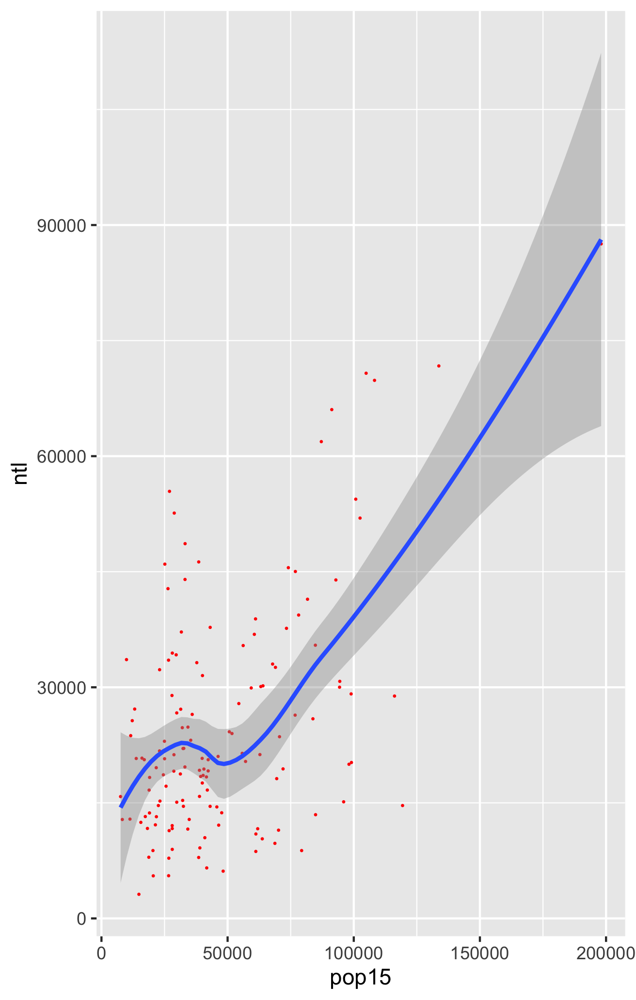

Shown here is the histogram and residual for Laos in terms of night time lights and population, with it showing that there are more night time lights in areas of higher population generally, with there being a wide range of night time lights values near the lower population side, with the higher night time lights being the richer small counties, and the low night time lights being the agricultural areas. 

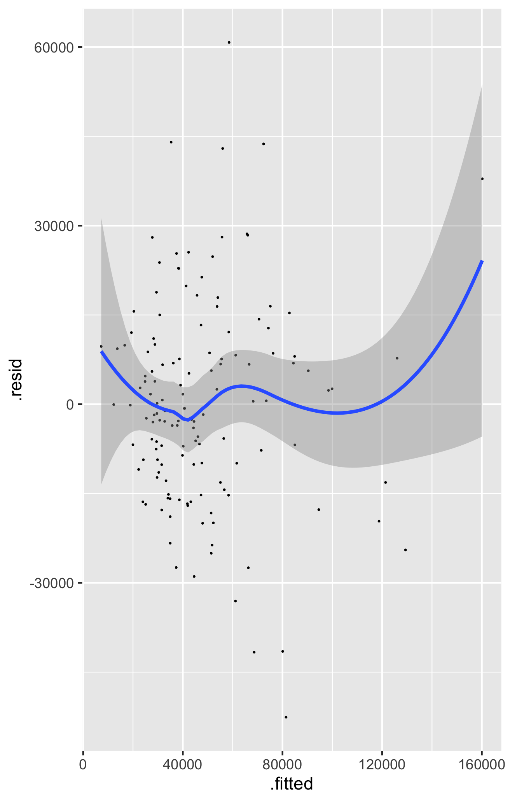

This is the regression for all covariates along with the population of Laos. 

## Population Sum

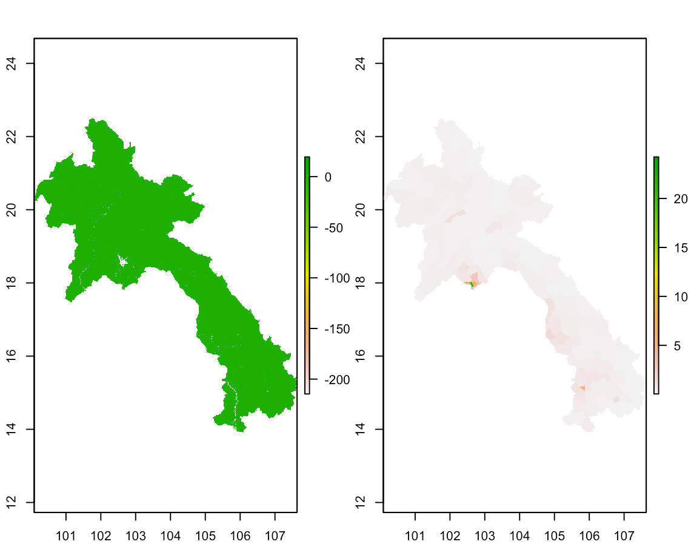

## Population Mean

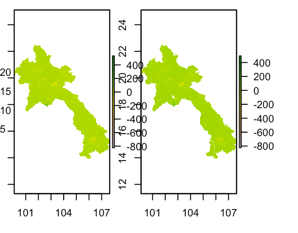

## Population logpop

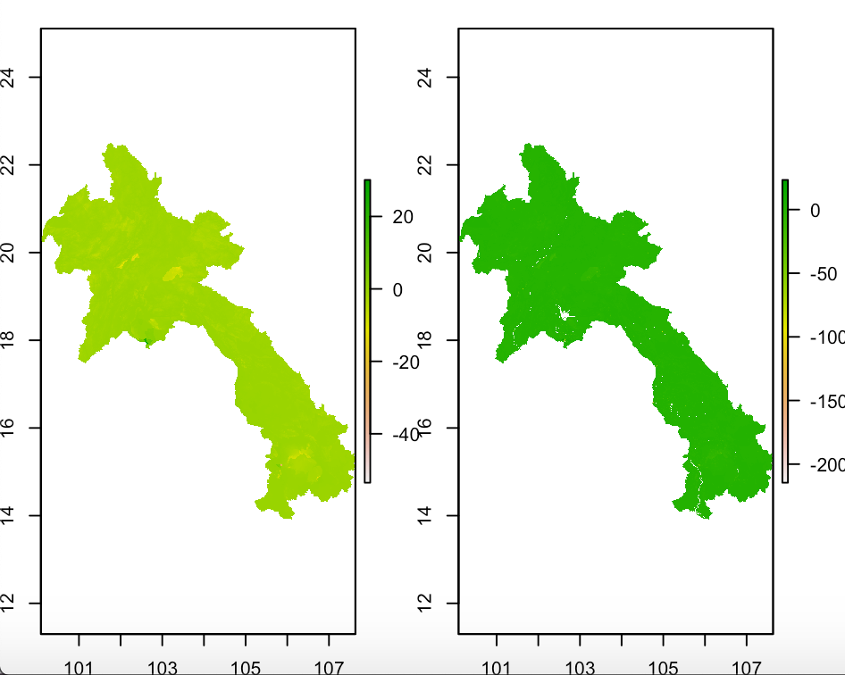

## Cellstats

The cellstats show that the most accurate model for me was the means model, as the absolute value of the difference from the actual population was the smallest. The difference of sums is also a good measure, as it did not overestimate as much as as the other two, but I still give the edge to means as it is a better overall graph

## Urban Areas, Roads, Healthcare Facilities in Xaythany and Mayparkngum, Laos

I chose Xaythany and Mayparkngum, Laos because these 2 districts have the highest population in the highest populated region, so I expected these to be the densest regions in Laos. 

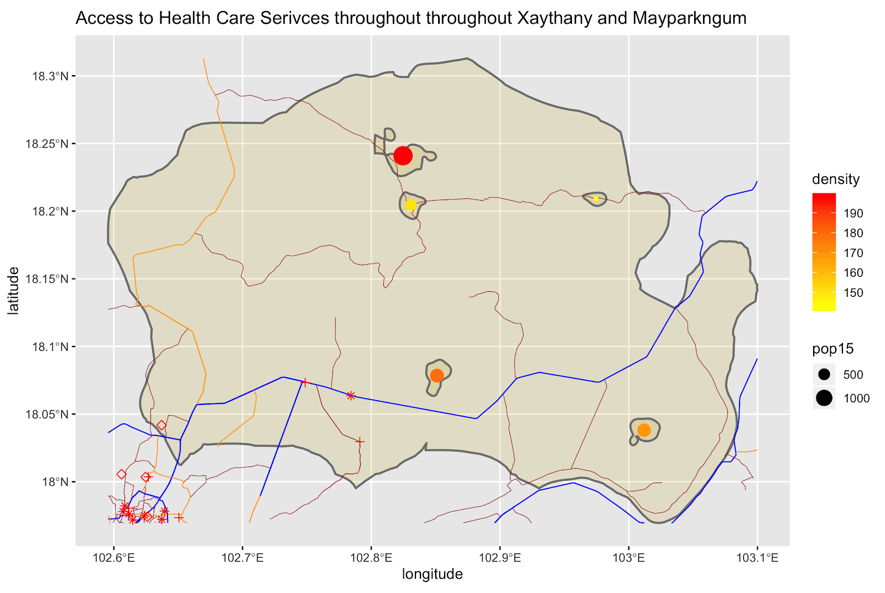

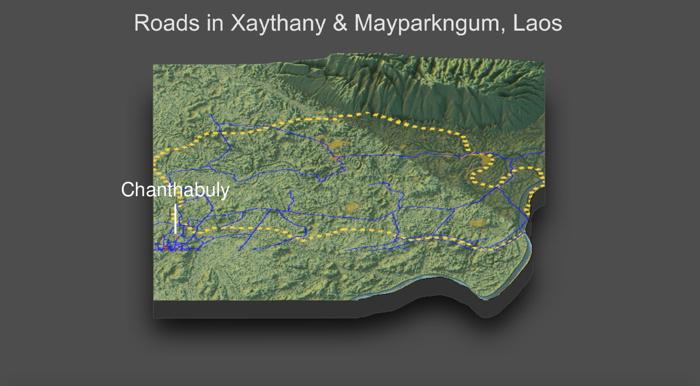

There are 5 urban areas and the total population is 233,600. Having the highest population, I expected this region to have a lot of urban areas, but the urban areas seen here are fairly small, along with only 23.7% of the population living in urban areas. These urban areas tend to be near roads, but only the 2 southern urban areas are near the primary road. The northern part of these regions have only tertiary(brown) roads with some secondary(yellow) roads, while the south has many primary(blue) and other roads. This makes transportation from the north to the south very difficult, especially considering that all 4 health facilities are in the south. This is explained by the south being the richer area, with the north being an agricultural area, and so many farmers have little to no immediate access to healthcare. If people living in the north did want to go south, they would have to drive through dirt roads and for many hours just to reach a hospital. The state of human development in Laos is described as developing. The healthcare service in Laos is very poor and biased, with typically only rich people having access to it, as rural areas have nearly 30% infant mortality rates, while richer areas have less than 5%. They are trying to combat this with universal healthcare, which will become possible because of outside investors, such as China, giving money to them (perhaps to develop another socialist country), with universal healthcare helping to provide people in rural areas healthcare. Laos is also currently building more modes of transportation, such as roads and a train going from the capital to China, creating more access for people. Although the state of human development currently is not the best, Laos is developing and will have a better living experience in the near future. 

## Table

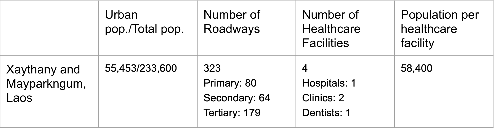
